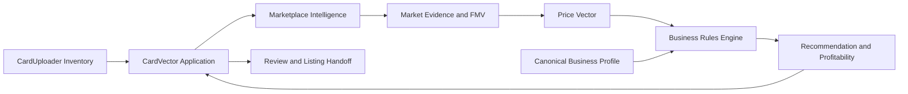
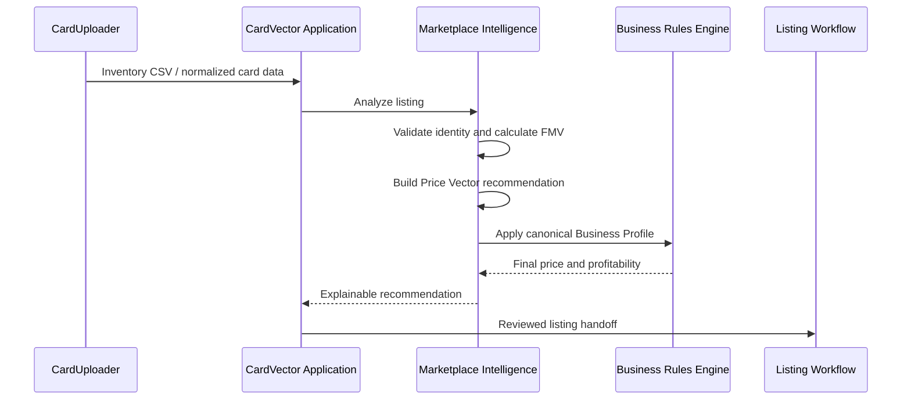
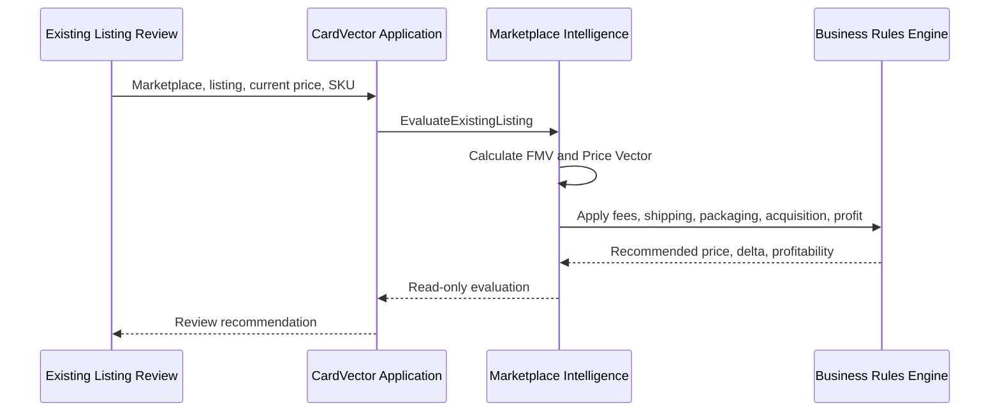

# Phase 8 Architecture Diagrams

## Ownership

```mermaid
flowchart LR
    CU[CardUploader Inventory] --> APP[CardVector Application]
    APP --> MI[Marketplace Intelligence]
    MI --> FMV[Market Evidence and FMV]
    FMV --> PV[Price Vector]
    PV --> BR[Business Rules Engine]
    BP[Canonical Business Profile] --> BR
    BR --> REC[Recommendation and Profitability]
    REC --> APP
    APP --> REVIEW[Review and Listing Handoff]
```

## New Inventory Sequence

```mermaid
sequenceDiagram
    participant CU as CardUploader
    participant APP as CardVector Application
    participant MI as Marketplace Intelligence
    participant BR as Business Rules Engine
    participant L as Listing Workflow
    CU->>APP: Inventory CSV / normalized card data
    APP->>MI: Analyze listing
    MI->>MI: Validate identity and calculate FMV
    MI->>MI: Build Price Vector recommendation
    MI->>BR: Apply canonical Business Profile
    BR-->>MI: Final price and profitability
    MI-->>APP: Explainable recommendation
    APP->>L: Reviewed listing handoff
```

## Existing Listing Sequence

```mermaid
sequenceDiagram
    participant UI as Existing Listing Review
    participant APP as CardVector Application
    participant MI as Marketplace Intelligence
    participant BR as Business Rules Engine
    UI->>APP: Marketplace, listing, current price, SKU
    APP->>MI: EvaluateExistingListing
    MI->>MI: Calculate FMV and Price Vector
    MI->>BR: Apply fees, shipping, packaging, acquisition, profit
    BR-->>MI: Recommended price, delta, profitability
    MI-->>APP: Read-only evaluation
    APP-->>UI: Review recommendation
```

No sequence performs a live listing update.
