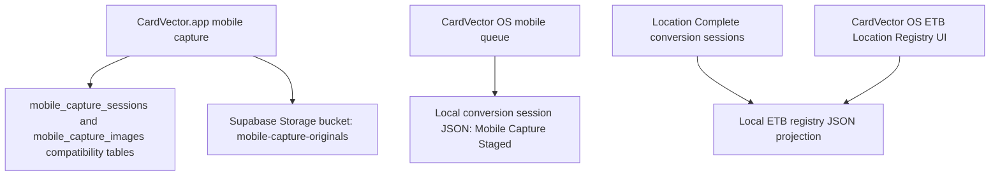

# Current State Findings

## Observed Architecture

CardVector OS and CardVector.app currently do not share one authoritative
registry for ETBs, locations, and mobile capture sessions.

## Exact Local Registry Files

- `Platform/Putnam_OS/System/data/inventory/etb_location_registry.json`
- `Data/Config/etb_location_registry.json`
- `Platform/Putnam_OS/System/config/location_registry.json`

The migration dry run backed up all three files under:

`Work_Sessions/supabase_registry_migration_dry_run_20260725/backups`

## Modules And Paths

- Local registry read/projection:
  `Platform/Putnam_OS/System/app/inventory_locations.py`
- Desktop registry UI:
  `Platform/Putnam_OS/System/app/putnam_os.py`
- Mobile capture queue:
  `Platform/Putnam_OS/System/tools/mobile_capture_queue.py`
- Mobile public capture app:
  `Docs/app.js`
- Existing Supabase migrations:
  `supabase/migrations/20260713153000_mobile_capture.sql`,
  `supabase/migrations/20260716130000_mobile_capture_type.sql`,
  `supabase/migrations/20260716130000_mobile_location_registry.sql`

## Root Cause

The desktop ETB Location Registry reads a legacy local JSON projection. That
projection is updated from conversion sessions only when their status is exactly
`Location Complete`. Mobile captures that have uploaded and staged successfully
remain `Mobile Capture Staged`, so they do not roll up into the registry shown
by CardVector OS.

## Supabase Check

Read-only project checks found:

- `mobile-capture-originals` storage bucket exists.
- Expected table endpoints previously returned 404:
  `mobile_capture_sessions`, `mobile_capture_images`, `cardvector_etbs`,
  `cardvector_locations`, `cardvector_location_operators`.

This implementation therefore adds a versioned canonical migration, but does
not apply it to production.

## Boundary Clarification

Supabase becomes canonical for the shared capture/location registry. CardUploader
continues to own managed card inventory, quantities, allocation, reservation,
and picking under CV-ADR-021.
