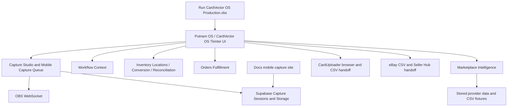

# CardVector Architecture Audit

**Audit date:** 2026-07-17
**Repository:** `C:\Users\user\OneDrive\PutnamCollectibles`
**Branch:** `main`
**Baseline commit:** `13fff8e` (`feat(site): add Google Analytics tag`)
**Audit mode:** Read-only analysis. No application code, data, launchers, or configuration was changed.

## Executive Summary

CardVector has a recognizable production workflow and several strong canonical components, but its ownership boundaries are uneven.

The current production desktop path is:

`Platform/Putnam_OS/Run CardVector OS Production.vbs`

to:

`Platform/Putnam_OS/System/app/putnam_os.py`

The current public workflow is:

Capture -> CardUploader -> CardVector import and pricing review -> eBay export/upload handoff.

The repository already has a strong independent pricing subsystem in `Platform/Marketplace_Intelligence`. Current uncommitted Price Vector work is consolidating Putnam OS pricing callers around that engine and separating Fair Market Value, recommended price, and final price. That work must be committed and validated before any architecture migration begins.

The highest architectural risk is `Platform/Putnam_OS/System/app/putnam_os.py`. It is both the production UI and a broad business-logic host. It currently contains or coordinates configuration, capture state, thumbnail handling, CSV import, eBay policy handling, pricing/export orchestration, inventory conversion, inventory audit state, acquisition/session persistence, comparison matching, logging, and most UI composition. It is operationally important and must be reduced incrementally rather than replaced.

Other material findings:

- There are two substantial Tkinter application implementations: `putnam_os.py` and `main.py`.
- Marketplace Intelligence is the correct dependency owner for market evidence, FMV, and pricing calculations.
- Physical inventory ownership is split between `inventory_locations.py`, UI-embedded workflows, local JSON, and Supabase synchronization.
- Capture ownership is split between current Capture Studio services, mobile queue tooling, UI state, and legacy OBS capture scripts.
- Shared concerns such as paths, configuration, logging, CSV parsing, money conversion, and filename handling are repeated.
- Several launchers are obsolete or broken after earlier folder reorganizations.
- Runtime and operator-state files remain tracked even though current `.gitignore` rules identify many of those areas as generated.
- The scanner and browser overlay are historical/reference projects under `Archive`, not current CardVector production subsystems.
- The root agent documentation points to governance files that no longer exist at those paths.

## Scope And Evidence

### Observed

The audit examined:

- Root folders and tracked files.
- Active Python, batch, VBS, HTML, JavaScript, SQL, JSON, and Markdown files.
- Current launchers and direct execution guards.
- Import relationships and dynamic path manipulation.
- Supabase migrations and browser/desktop location contracts.
- Existing Phase 0 audit and consolidation reports in `Archive/Reports/reports`.
- Current governance and product documents in `Docs`.
- Git status, including pre-existing modified and untracked files.

### Not Performed

- No application was launched.
- No automated tests were run.
- No database or runtime file was opened for mutation.
- No dead-code candidate was removed or moved.
- No claim of runtime usage was made solely from a filename; recommendations use references, launcher targets, imports, documentation, and current workflow evidence.

## Current Production Architecture



## Architectural Strengths

### Observed

1. `Platform/Marketplace_Intelligence` is independent of Putnam OS and can be reused by UI, CLI, and tests.
2. `capture_studio.py`, `obs_connection_manager.py`, `inventory_locations.py`, `orders_fulfillment.py`, and `workflow_context.py` already provide focused seams around the production UI.
3. The mobile queue uses atomic workstation claiming and preserves the established dated-folder routing.
4. Supabase migrations preserve authenticated access, RLS, canonical capture types, and secure location creation.
5. Public website deployment is isolated through `Tools/export_cardvector_site.py` and `.github/workflows/pages.yml`, which publishes to the separate `CardVector-site` repository.
6. Current documentation describes CardVector as a workflow conductor rather than a replacement for CardUploader or eBay.
7. Generated-output paths are increasingly covered by `.gitignore`.

## Architecture Violations

### 1. Multiple Application Entry Points

**Observed:** `putnam_os.py` and `main.py` both define large Tkinter applications with overlapping import, pricing, export, and configuration behavior. Only `putnam_os.py` is the production launcher target.

**Risk:** High. Changes can be applied to the wrong UI or preserve behavior in one path but not the other.

**Recommendation:** Keep the production launcher pointed at `putnam_os.py` until a small official bootstrap is introduced. Determine which tested compatibility surfaces still require `main.py`, then retire or reduce it in a separate migration package.

### 2. Business Logic Inside The UI

**Observed:** `putnam_os.py` contains business rules and persistence alongside Tkinter construction and callbacks.

**Risk:** High. UI changes can alter pricing, inventory, capture, or export behavior.

**Recommendation:** Extract one tested use case at a time behind existing interfaces. Do not rewrite the UI and engines together.

### 3. Shared Infrastructure Has No Complete Owner

**Observed:** `Platform/putnam_paths.py` is the strongest path owner, but root discovery, JSON configuration, CSV reading, money conversion, filename safety, and log writing are repeated across subsystems.

**Risk:** Medium. Multi-workstation behavior and error handling can diverge.

**Recommendation:** Establish `Platform/Shared` as the canonical owner and migrate callers incrementally after contract tests exist.

### 4. Capture Responsibilities Are Split

**Observed:** Current capture behavior spans `capture_studio.py`, `obs_connection_manager.py`, `mobile_capture_queue.py`, UI state in `putnam_os.py`, and older `Platform/Putnam_Platform/capture` scripts.

**Risk:** High. Capture is a validated production workflow and older scripts remain runnable.

**Recommendation:** Treat Capture Studio plus the shared OBS manager and mobile queue as canonical. Archive legacy capture only after launcher/reference validation.

### 5. Inventory Responsibilities Are Split

**Observed:** ETB/location state is owned by `inventory_locations.py`, conversion and audit workflows remain partly inside `putnam_os.py`, synchronization is in `mobile_capture_queue.py`, and an older Seller Tools registry uses a different location concept.

**Risk:** High. Location identity, occupancy, SKU/batch assignment, and cloud synchronization are related but not identical.

**Recommendation:** Document the boundaries before extraction: canonical location identity, operational occupancy, conversion sessions, reconciliation, and legacy SKU planning.

### 6. Configuration And Runtime Data Are Mixed With Source

**Observed:** Configuration appears under `Data/Config`, `Platform/Putnam_OS/config`, `System/config`, and Marketplace Intelligence config. Some operational JSON and cache files are tracked.

**Risk:** Medium to high. Git merges can overwrite workstation or business state.

**Recommendation:** Separate versioned defaults/schema from operator state and secrets. Do not untrack anything until data ownership and migration/backup rules are approved.

### 7. Temporary And Backup Code Beside Production Code

**Observed:** Seven tracked timestamped `putnam_os_*backup*.py` files and three current untracked `.bak` files are beside active source. A root patch script is also untracked.

**Risk:** Medium. Search results and maintenance can target stale copies.

**Recommendation:** Preserve until current work is committed, then archive in a dedicated cleanup package with a manifest.

### 8. Stale Path Assumptions

**Observed:** Business pricing launchers hard-code `C:\Users\JaredHill`; `Run_OBS_AutoCrop.bat` points to a pre-reorganization path; Decision Engine code expects a root-level `Putnam_OS`.

**Risk:** Medium. Features may silently fall back, appear empty, or fail on another workstation.

**Recommendation:** Correct paths only within subsystem-specific, tested migration packages.

### 9. Documentation Entry-Point Drift

**Observed:** Root `AGENTS.md` points to missing files such as `Docs/AGENTS.md` and `Docs/PROJECT_STATUS.md`. Current governance lives under different filenames, while the constitution and Phase 0 reports are archived.

**Risk:** Medium. A new developer or Codex task may read incomplete governance.

**Recommendation:** Restore one current documentation entry point and cross-link archived historical decisions rather than duplicating them.

## Recommended Long-Term Architecture

```text
Platform/
    main.py
    Putnam_OS/
        app/
        application/
    Marketplace_Intelligence/
    Capture/
    Inventory/
    Orders/
    Shared/

Business/
Data/
Docs/
Tools/
Tests/
Archive/
```

### Folder Responsibilities

- `Platform/main.py`: the only official production bootstrap. It selects configuration, initializes shared services, and starts Putnam OS. It contains no business rules.
- `Platform/Putnam_OS/app`: desktop UI and presentation adapters only.
- `Platform/Putnam_OS/application`: workflow orchestration and job context for Capture -> CardUploader -> Pricing -> eBay handoffs.
- `Platform/Marketplace_Intelligence`: market evidence, FMV, Price Vector, recommendation persistence, provider adapters, pricing reports, and marketplace-specific export decisions.
- `Platform/Capture`: Capture Studio, OBS connection, mobile queue, capture session contracts, thumbnails, and local routing.
- `Platform/Inventory`: ETB/location registry, conversion sessions, cloud projection/sync, reconciliation, and inventory repositories.
- `Platform/Orders`: order import, grouping, pick lists, and fulfillment reports.
- `Platform/Shared`: path management, configuration loading, logging, CSV/file helpers, money conversion, and safe atomic persistence.
- `Business`: operator-owned business documents and external operational inputs that are not source code.
- `Data`: generated imports, exports, caches, logs, runtime state, and databases, normally outside Git except schemas and samples.
- `Docs`: current governance, architecture, operations, and public static source where explicitly required.
- `Tools`: standalone maintenance, migration, validation, and deployment tools. Tools may call platform APIs but do not own business rules.
- `Tests`: cross-subsystem contract and integration tests; subsystem unit tests may remain beside their owners.
- `Archive`: historical, superseded, and legacy-reference material that must not be imported or launched by production code.

## Permanent Dependency Rules

1. UI may call application services; UI must not calculate prices, mutate registry files directly, or implement marketplace matching.
2. Application orchestration may depend on subsystem interfaces, not Tkinter widgets.
3. Marketplace Intelligence must not import Putnam OS.
4. Capture, Inventory, and Orders must not import UI modules.
5. Shared infrastructure must not import business subsystems.
6. Tools may depend on platform services; production code must not depend on Tools.
7. Archive must never be on a production import path.
8. CardUploader remains an external recognition and managed-inventory system. CardVector integrates by explicit handoff and supported data contracts.
9. Scanner recognition remains outside the current CardVector production dependency graph unless a future approved subsystem is introduced.

## Risk Priorities

| Area | Risk | Reason |
|---|---|---|
| `putnam_os.py` decomposition | High | Production UI and business behavior are intertwined |
| `main.py` disposition | High | Overlapping app plus current pricing compatibility tests |
| Capture consolidation | High | Validated workflow with current and legacy implementations |
| Inventory ownership | High | Local state, cloud identity, conversion, and legacy SKU concepts overlap |
| Price Vector working tree | High | Valid uncommitted production work must be preserved first |
| Shared path/config extraction | Medium | Broad caller count but can be migrated incrementally |
| Runtime data retention | Medium | Business/operator state may be lost if untracked carelessly |
| Broken launchers | Low | High-confidence stale files, but references still require checking |
| Archived scanner/overlay | Low | Already isolated; retain as reference |

## Conclusions

### Observed

CardVector does not need a replacement architecture. It needs canonical ownership made explicit and the production monolith reduced through tested delegation. Marketplace Intelligence is already close to the desired pricing boundary. Capture, inventory, orders, and workflow context have useful service modules that can be promoted without replacing working behavior.

### Recommendation

The next action should not be a folder move. First:

1. Commit or deliberately preserve the current Price Vector and website work.
2. Record the architecture manifest and official production entry point.
3. Establish regression tests around launch, capture routing, import/pricing, eBay export, inventory registry, and orders.
4. Extract shared infrastructure and subsystem services one bounded package at a time.
5. Archive legacy implementations only after reference and launcher checks prove they are unused.

See:

- `Repository_Inventory.md`
- `Entry_Point_Report.md`
- `Duplicate_Module_Report.md`
- `Dependency_Map.md`
- `Module_Ownership.md`
- `Dead_Code_Report.md`
- `Architecture_Roadmap.md`
