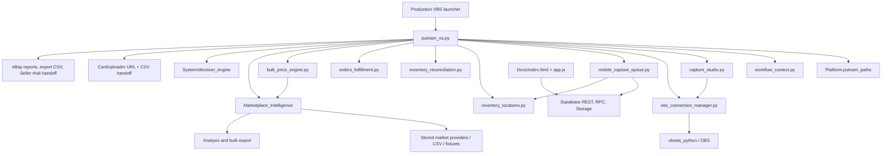
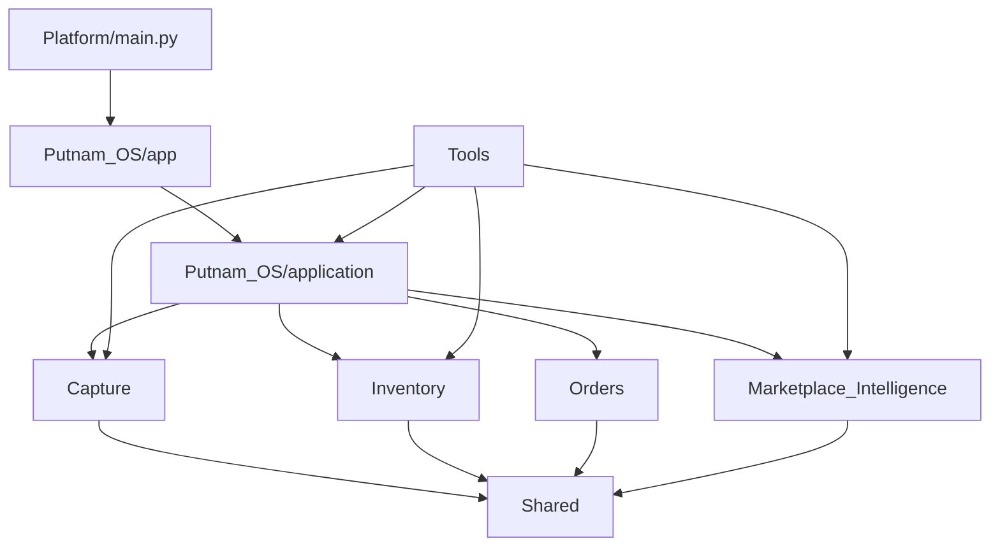

# CardVector Dependency Map

**Audit date:** 2026-07-17
**Method:** Static imports, dynamic imports/path manipulation, launchers, migrations, configuration references, and documented runtime contracts.

## Top-Level Runtime Map

## CardVector OS Direct Dependencies

### Observed

`Platform/Putnam_OS/System/app/putnam_os.py` depends on:

- Standard library and Tkinter.
- Pillow for thumbnails/images.
- `Platform.putnam_paths` after path manipulation.
- local app modules through bare imports:
  - `capture_studio`
  - `obs_connection_manager`
  - `workflow_context`
  - `bulk_price_engine`
  - `inventory_locations`
  - `inventory_reconciliation`
  - `orders_fulfillment`
- `System/tools/mobile_capture_queue.py`.
- Marketplace Intelligence pricing/models through repository path setup.
- Decision Engine through dynamic/module loading.
- JSON/CSV filesystem state under `System/data`, `System/config`, and `Data`.
- external browser handoffs to CardUploader and eBay.

### Risk

Bare imports and `sys.path` mutation make package ownership dependent on startup location. This also makes static cycle detection less reliable.

## Second-Level Dependencies

### Capture Studio

`capture_studio.py`:

- owns local capture sessions and front/back file naming,
- calls shared `obs_connection_manager.py`,
- uses platform paths including a legacy `PUTNAM_PLATFORM_DIR` concept,
- returns session state to the UI.

`obs_connection_manager.py`:

- owns OBS host/port/password settings and connection states,
- depends on `obsws_python`,
- should not depend on UI.

`mobile_capture_queue.py`:

- depends on Supabase REST/RPC/Storage contracts,
- performs atomic session claims,
- downloads authenticated images,
- routes by capture type,
- imports `app.inventory_locations` for location synchronization.

Improper dependency: infrastructure/tool code importing an app-layer module.

### Inventory

`inventory_locations.py`:

- reads/writes local ETB registry JSON,
- merges cloud location identity data,
- computes location and ETB statuses/counts,
- supports label-related actions.

`inventory_reconciliation.py`:

- reads CardUploader/eBay exports,
- normalizes and compares rows,
- produces conservative reconciliation outputs.

`putnam_os.py`:

- still owns conversion session UI/state and audit/report workflow behavior.

Supabase migration:

- owns cloud ETB/location identity, uniqueness, authenticated RLS, and atomic creation.

### Pricing And Marketplace

Putnam OS callers:

- `putnam_os.py`
- `main.py`
- `bulk_price_engine.py`
- `System/MarketIntelligence/Pricing/*`

depend on:

`Platform/Marketplace_Intelligence/marketplace_intelligence/pricing_engine.py`

The canonical engine then uses models/config and is orchestrated by:

`marketplace_intelligence/engine.py`

which depends on:

- CSV import and listing parser,
- identity matching,
- provider abstraction,
- FMV/pricing,
- decision engine,
- reports and bulk export.

Correct direction: Marketplace Intelligence does not import Putnam OS.

### Orders

`orders_fulfillment.py`:

- imports order CSVs,
- normalizes variable eBay columns,
- groups line items by order,
- renders pick slips.

`putnam_os.py` supplies UI orchestration and folder actions.

### Decision Engine

`System/decision_engine`:

- defines checks for pricing, inventory, marketplace, and placeholder future areas,
- is loaded by Putnam OS,
- uses stale assumptions about a root-level `Putnam_OS` path in some checks/config access.

This may cause missing/default data rather than an obvious import failure.

## External System Boundaries

### CardUploader

No CardUploader recognition engine is imported into CardVector.

CardVector uses:

- browser URL handoff,
- CSV import,
- stored inventory/sales cache adapters,
- location/batch links,
- reconciliation.

CardUploader remains the external recognition and managed-inventory system.

### eBay

No deep upload automation is required by the production workflow.

CardVector uses:

- active-listing/order CSV input,
- policy configuration,
- eBay-compatible export,
- Seller Hub/upload browser handoff.

### Supabase

Browser:

- authenticated capture sessions,
- authenticated storage upload,
- ETB/location reads and secure creation RPC.

Desktop:

- service-role environment credential,
- queue polling/claiming/download,
- location synchronization.

The service-role key is not part of browser configuration.

### OBS

Current desktop Capture Studio uses one shared OBS connection manager. Legacy OBS scripts remain separate and should not be mixed into the production path.

## Static Import Direction Assessment

### Healthy directions

- Putnam OS -> Marketplace Intelligence.
- Capture Studio -> OBS connection manager.
- UI -> focused Orders/Inventory/Capture services.
- Web client -> Supabase public/authenticated contracts.
- Tools -> platform source for validation/export.

### Improper or fragile directions

- `mobile_capture_queue.py` under `System/tools` -> `System/app/inventory_locations.py`.
- Production UI -> many persistence and business-rule details directly.
- Multiple modules -> root discovery/config files directly.
- `run_pricing_cli.py` performs work at import time.
- Tests and modules rely on local bare imports and path mutation.

## Circular Dependency Findings

### Observed

No definite static circular import was found among the primary canonical modules during this audit.

### Qualification

Confidence is moderate, not absolute, because:

- `putnam_os.py` mutates `sys.path`,
- several imports are local/bare,
- some features load modules dynamically,
- UI callbacks defer imports,
- tools import from app folders.

### Recommendation

Add an import-graph check after package boundaries are formalized. Do not perform package moves before import-contract tests exist.

## Tight Coupling Findings

| Coupling | Risk | Evidence |
|---|---|---|
| UI to filesystem/state schemas | High | UI reads/writes multiple JSON/CSV runtime stores |
| UI to pricing/export details | High | Pricing and eBay workflow callbacks in monolith |
| Mobile queue to app inventory module | Medium | Tool imports UI-area module |
| Decision checks to old root layout | Medium | Root-level `Putnam_OS` assumption |
| Tests to working directory | Medium | Bare imports and local path insertion |
| Seller tools to legacy location format | Medium | Separate registry and ETB naming rules |
| Public site source inside Docs | Low/Medium | Intentional export contract, but docs changes trigger deploy |

## Recommended Dependency Direction

Prohibited:

- Shared -> business subsystem.
- Subsystem -> UI.
- Production -> Tools.
- Production -> Archive.
- Marketplace Intelligence -> Putnam OS.
- Inventory -> Capture UI.

## Verification Needed During Refactor

- Generate an automated import graph.
- Add package import smoke tests from the repository root and outside it.
- Test production launcher without relying on the current working directory.
- Test each subsystem with injected paths/config.
- Confirm background threads stop cleanly.
- Confirm mobile queue and inventory synchronization remain atomic and idempotent.
